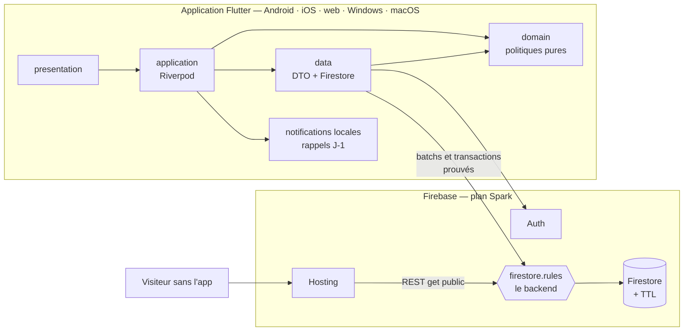

# EventHub

> Application Flutter **multiplateforme** (Android, iOS, web, Windows, macOS)
> de découverte, de réservation et d'organisation d'événements, adossée à
> **Firebase Auth** et **Cloud Firestore** sur le plan gratuit **Spark**.
> Un compte, deux espaces : chacun **participe** (découvre, réserve, garde son
> billet) et peut activer l'espace **organisateur** (publie, compose une
> équipe, contrôle les billets à l'entrée).
> Cahier des charges : `EVENTHUB — Cahier des charges MVP.pdf`.

[](.github/workflows/ci.yml)


-10B981)


---

## Sommaire

1. [Vue d'ensemble](#1-vue-densemble)
2. [Fonctionnalités](#2-fonctionnalités)
3. [Architecture](#3-architecture)
4. [Stack technique](#4-stack-technique)
5. [Mise en route](#5-mise-en-route)
6. [Modèle de données](#6-modèle-de-données)
7. [Règles métier](#7-règles-métier)
8. [Sécurité](#8-sécurité)
9. [Notifications](#9-notifications)
10. [Limites assumées du plan Spark](#10-limites-assumées-du-plan-spark)
11. [Production : Crashlytics, Analytics, hors ligne](#11-production--crashlytics-analytics-hors-ligne)
12. [Design system](#12-design-system)
13. [Écrans et routes](#13-écrans-et-routes)
14. [Configuration](#14-configuration)
15. [Qualité : lint, tests, CI](#15-qualité--lint-tests-ci)
16. [Commandes](#16-commandes)
17. [Scénario de démonstration](#17-scénario-de-démonstration)
18. [Décisions d'architecture (ADR)](#18-décisions-darchitecture-adr)
19. [Périmètre et cahier des charges](#19-périmètre-et-cahier-des-charges)
20. [Dépannage](#20-dépannage)
21. [Contribuer](#21-contribuer)

Documentation détaillée :
[`EQUIPE.md`](EQUIPE.md) (qui a fait quoi, relevé dans l'historique Git),
[`docs/ARCHITECTURE.md`](docs/ARCHITECTURE.md) (couches, modèle par
collection, patterns sans serveur),
[`docs/SECURITY.md`](docs/SECURITY.md) (modèle de menace, règles, limites,
App Check, secrets),
[`docs/CONVENTIONS.md`](docs/CONVENTIONS.md) (conventions de la couche de
données Firestore),
[`docs/ROADMAP.md`](docs/ROADMAP.md) (F-01 à F-20, ce que Blaze débloquerait),
[`docs/DESIGN_SYSTEM.md`](docs/DESIGN_SYSTEM.md) (langage visuel).

---

## 1. Vue d'ensemble

| Espace | En une phrase |
|---|---|
| **Participant** (tout compte) | découvre les événements (dont « Pour vous »), voit qui y va, garde des favoris, suit des organisateurs, réserve une place gratuite, rejoint la liste d'attente, présente son billet QR, laisse un avis après l'événement |
| **Organisateur** (activé par « Devenir organisateur », email vérifié) | publie ses événements avec des types de billets, compose une équipe, soigne sa page publique, est prévenu à chaque réservation, suit stats et alertes, exporte sa liste d'invités en CSV, scanne les billets à l'entrée |
| **Administrateur** (document `admins/{uid}` créé dans la console) | traite la file de modération : masquer un avis, retirer un événement, suspendre un compte |

**Il n'y a pas de backend simulé, et il n'y a pas de serveur.** Toutes les
données vivent dans le projet Firebase `eventhub-d411f`. Le client écrit
directement dans Firestore ; **les règles de sécurité**
(`firebase/firestore.rules`) sont le seul code exécuté côté Google et portent
tous les invariants métier. Pourquoi ce choix ? Le plan Spark est gratuit ;
Cloud Functions, Cloud Storage et Cloud Scheduler exigent le plan Blaze
(compte de facturation). Ce qui dépend d'un serveur est explicitement listé en
[§10](#10-limites-assumées-du-plan-spark).

| Brique | Rôle dans EventHub |
|---|---|
| **Firebase Auth** | email + mot de passe avec vérification d'adresse, Google, réinitialisation, suppression de compte |
| **Cloud Firestore** | comptes, pages organisateurs, événements et types de billets, réservations, équipes, favoris, abonnements, liste d'attente, avis, signalements, modération, notifications, préférences, appareils ; cache hors ligne |
| **Règles Firestore** | droits, formes des documents, preuves inter-documents (`getAfter` / `existsAfter`) : aucune survente, aucun compteur falsifiable |
| **TTL Firestore** | purge automatique des notifications après 30 jours |
| **Hosting** | page publique `/e/{id}` (lecture par l'API REST), App Links Android, accueil |
| **FCM** | jetons enregistrés, messages au premier plan (pas d'envoi serveur sur Spark) |
| **Crashlytics · Analytics** | plantages ; mesure d'audience sur consentement |

---

## 2. Fonctionnalités

### 2.1 Compte

| Fonctionnalité | Détail |
|---|---|
| Inscription | email + mot de passe (8 caractères, lettres et chiffres) ou Google ; tout compte naît **participant** ; email de vérification envoyé par Firebase Auth |
| Vérification d'email | lien envoyé par Firebase ; exigée pour devenir organisateur, publier et laisser un avis ; renvoi depuis le bandeau |
| **Devenir organisateur** | un seul batch : rôle, page publique et entrée de recherche par email ; sens unique ; l'espace participant reste disponible |
| Mots de passe | oubli : email Firebase de réinitialisation ; changement avec ré-authentification |
| Profil | nom, présentation publique pour un organisateur |
| Profil organisateur public | `/organizers/{id}` : présentation, nombre d'événements, abonnés, note moyenne (compteurs prouvés par les règles), bouton **Suivre** |
| Signalement | événement, organisateur ou avis ; motif fermé ; un par compte et par contenu |
| Paramètres | thème, préférences de notification, mesure d'audience, **suppression du compte** (ré-authentification, places libérées, historique anonymisé) |
| Centre de notifications | temps réel, 30 jours, « tout lire », balayage pour supprimer, tap vers l'écran concerné |

### 2.2 Espace participant

| Fonctionnalité | Détail |
|---|---|
| Fil éditorialisé | à la une, **pour vous**, ça se remplit vite, cette semaine, catalogue paginé |
| Pour vous | recommandations calculées sur l'appareil (organisateurs suivis, catégories des billets et favoris) |
| Recherche et filtres | titre, lieu, organisateur, catégorie ; période, tri, masquer les complets |
| Favoris | cœur optimiste, annulé si l'écriture échoue |
| Fiche événement | jauge temps réel, « Soa, Hery R. et 40 autres y vont », types de billets, prix affichés, partage, signalement |
| Réserver / annuler | **transaction** place + réservation prouvée par les règles : aucune survente, même à plusieurs au même instant ; re-réservation sur le même billet |
| Types de billets | choix du type au moment de réserver ; **seuls les types gratuits sont réservables** (paiements suspendus, [§10](#10-limites-assumées-du-plan-spark)) |
| Liste d'attente | sur un événement complet ; notification in-app quand une place se libère |
| Billet | QR + code `EH-XXXX-XXXX`, lisible hors ligne une fois affiché |
| Rappel J-1 | **notification locale** planifiée sur l'appareil |
| Avis | après le début de l'événement, pour les présents vérifiés ; la note de l'organisateur suit dans le même batch |
| Partage | lien `https://eventhub-d411f.web.app/e/{id}` : page web sans l'app, ouverture directe dans l'app sur Android |

### 2.3 Espace organisateur

| Fonctionnalité | Détail |
|---|---|
| Mes événements | KPI, à venir / passés, co-organisés ; suppression refusée s'il y a des réservations |
| Créer / modifier | image par **URL https**, validation immédiate puis par les règles, email vérifié requis |
| Types de billets | jusqu'à 6 types (nom, description, places, prix affiché), devise EUR, USD ou MGA ; la capacité ne descend jamais sous les places prises |
| Participants | recherche, type de billet, compteur d'entrées, export CSV (UTF-8 avec BOM, `;`) |
| Équipe | jusqu'à 10 co-organisateurs invités par email ; un co-organisateur modifie, voit les participants et scanne, mais ne supprime pas et ne compose pas l'équipe |
| Contrôle à l'entrée | scanner caméra, saisie manuelle ; `checkins/{reservationId}` en création seule : deux portes n'admettent qu'une personne |
| Stats · Alertes | remplissage, 14 jours de réservations, classement ; à surveiller + journal |

### 2.4 Administration

File de modération (ouverts / traités), dossier (contenu, signalements,
décisions), décisions : masquer / rétablir un avis (la note suit), retirer un
événement (réservations annulées), suspendre / réactiver un compte. Les
administrateurs se gèrent **dans la console Firebase** ([§5.6](#56-premier-administrateur)).

### 2.5 Profil et espaces

Un compte, deux espaces : tout le monde s'inscrit participant, et « Devenir
organisateur » ouvre le second espace depuis le profil (email vérifié exigé,
sens unique) ; une entrée de menu fait ensuite l'aller-retour entre les deux.
Le profil porte une **photo** et une **photo de couverture**, choisies dans la
galerie ou prises à l'appareil, rognées et compressées sur l'appareil puis
enregistrées dans le document Firestore — Cloud Storage exigerait le plan
Blaze ([§18](#18-décisions-dingénierie)).

### 2.6 Transverse

Layout **responsive** (téléphone, tablette, web, bureau) : barre de navigation
en bas sur téléphone, rail latéral au-delà de 600 px et rail étendu avec
libellés au-delà de 1024 px. Bandeau hors ligne,
cache Firestore persistant, rapport de plantage, consentement à la mesure
d'audience.

---

## 3. Architecture



Feature-first, en couches : `presentation → application → domain ← data`.
Seule `data` importe `cloud_firestore` / `firebase_auth`. Le domaine vérifie
d'abord (message précis et immédiat), les règles tranchent (garantie). Détail
complet, arborescence et patterns : [`docs/ARCHITECTURE.md`](docs/ARCHITECTURE.md).

**Comment fonctionne une application sans serveur ?**

| Besoin habituellement serveur | Solution sur Spark |
|---|---|
| Compteurs (places, abonnés, note) | écrits par le client **dans le batch** qui contient leur cause ; les règles comparent l'avant et l'après (`getAfter`) |
| Unicité (une réservation, un avis) | identifiants déterministes `{eventId}_{uid}` |
| Notifications à autrui | écrites par l'acteur, identifiant déterministe par fait, fait prouvé par la règle |
| Rappels planifiés | notifications locales sur l'appareil |
| Cascades (suppression de compte) | séquence client idempotente, chaque étape autorisée par une branche de règle |
| Purge | politique TTL Firestore |
| Page publique | HTML statique + API REST Firestore |

---

## 4. Stack technique

| Domaine | Choix |
|---|---|
| Framework | Flutter 3.47 / Dart 3.13, cibles Android, iOS, web, Windows, macOS |
| État | Riverpod 3 + `riverpod_generator` |
| Navigation | go_router 18 (`StatefulShellRoute` par espace, guard pur) |
| Modèles | freezed + json_serializable (DTO camelCase, miroir des règles) |
| Backend | `firebase_core`, `firebase_auth`, `cloud_firestore` |
| Services Firebase | `firebase_messaging`, `firebase_crashlytics`, `firebase_analytics` |
| Auth tierce | `google_sign_in` 7 (Android/iOS), popup Firebase (web) |
| Appareil | `flutter_local_notifications`, `mobile_scanner`, `connectivity_plus`, `qr_flutter`, `share_plus`, `url_launcher`, `shared_preferences` |
| UI | Material 3 clair/sombre, `google_fonts`, `cached_network_image` |
| Qualité | `flutter_lints` strict, `riverpod_lint`, `mocktail`, `@firebase/rules-unit-testing` + `node:test` sur l'émulateur, GitHub Actions |

---

## 5. Mise en route

### 5.1 Prérequis

| Outil | Pourquoi |
|---|---|
| Flutter 3.47+ | l'app |
| Node 20+ (22 recommandé) | CLI Firebase (épinglée dans `firebase/tests/package-lock.json`) et suite des règles |
| **Java 21** | les émulateurs Firestore et Auth sont des programmes Java |
| `make` | raccourcis (Git Bash ou WSL sous Windows) |
| FlutterFire CLI | `dart pub global activate flutterfire_cli` — pour régénérer `lib/firebase_options.dart` |

```sh
git clone <repo> eventhub && cd eventhub
make setup          # flutter pub get + génération de code
make rules-setup    # npm ci : suite des règles + CLI Firebase épinglée
make rules-test     # 95 tests des règles sur l'émulateur Firestore
```

Le projet `eventhub-d411f` est déjà configuré (`.firebaserc`,
`lib/firebase_options.dart` versionné) : pour **utiliser** le projet
existant, passer directement à [§5.7](#57-lancer-lapplication). Les étapes
5.2 à 5.6 décrivent la création d'un projet neuf (fork, staging, prod).

### 5.2 Créer le projet Firebase et relier l'app

1. [console.firebase.google.com](https://console.firebase.google.com) → *Ajouter
   un projet*. Rester sur le plan **Spark**. Analytics : oui (utilisé après
   consentement).
2. Se connecter à la CLI et relier le dossier :
   ```sh
   npx --prefix firebase/tests firebase login
   npx --prefix firebase/tests firebase use --add      # choisir le projet, alias "default"
   ```
3. Générer la configuration client pour toutes les plateformes :
   ```sh
   flutterfire configure --project=<project-id> \
     --platforms=android,ios,macos,web,windows
   ```
   Cela réécrit `lib/firebase_options.dart` et le bloc `flutter` de
   `firebase.json`. **Ce fichier est public par conception** : il ne contient
   que des identifiants présents dans chaque build
   ([`docs/SECURITY.md`](docs/SECURITY.md) §9). Mettre à jour aussi
   `hosting/public/eventhub-config.js` (`projectId`, `apiKey` de l'entrée `web`).

### 5.3 Activer l'authentification

Console → *Authentication* → *Sign-in method* :

1. **Adresse e-mail/Mot de passe** : activer (sans « lien par e-mail »).
2. **Google** : activer, choisir l'adresse d'assistance.
   - **Android** : ajouter les empreintes **SHA-1 et SHA-256** de la clé de
     debug et de la clé release dans *Paramètres du projet → Vos applications →
     Android* (`cd android && ./gradlew signingReport`), puis relancer
     `flutterfire configure`. Copier l'**ID client OAuth de type Web**
     (Google Cloud → *Identifiants*, créé automatiquement) dans
     `GOOGLE_SERVER_CLIENT_ID` de `env/<flavor>.json` : sans lui, le bouton
     Google est masqué sur Android.
   - **iOS / macOS** : `GIDClientID` et le schéma d'URL inversé dans
     `Info.plist` (déjà présents pour `eventhub-d411f`).
   - **Web** : ajouter le domaine de déploiement dans *Authentication →
     Paramètres → Domaines autorisés* (`localhost` y est par défaut).
3. *Authentication → Modèles* : personnaliser en français les emails de
   vérification et de réinitialisation (nom de l'app, expéditeur). Firebase
   les envoie lui-même : **aucun SMTP à configurer**.

### 5.4 Créer Firestore et déployer les règles

1. Console → *Firestore Database* → *Créer une base de données*, mode
   **production** (tout refusé tant que les règles ne sont pas déployées),
   emplacement **nam5** (celui de `firebase.json`). ⚠️ L'emplacement est
   **définitif**.
2. Déployer règles, index composites et politique TTL — les tests passent
   d'abord :
   ```sh
   make deploy-rules      # = make rules-test, puis firebase deploy --only firestore:rules,firestore:indexes
   ```
   La construction des index prend quelques minutes (*Firestore → Index*).
   Tant qu'un index est « en cours », la requête qui en dépend échoue avec
   `failed-precondition`.

### 5.5 Politique TTL des notifications

Les notifications portent `expiresAt` (création + 30 jours). La politique TTL
les supprime automatiquement (délai de suppression : généralement sous 24 h
après l'échéance, sans garantie stricte).

- `firebase/firestore.indexes.json` la déclare (`fieldOverrides` →
  `notifications.expiresAt`, `"ttl": true`) : `make deploy-rules` l'applique.
- **Vérifier une fois** dans Console → *Firestore* → *TTL* que la politique
  `notifications` / `expiresAt` est **active** (et non « en création »). À
  défaut, la créer à la main dans cet écran, ou :
  ```sh
  gcloud firestore fields ttls update expiresAt \
    --collection-group=notifications --enable-ttl --project=<project-id>
  ```
- Les suppressions TTL comptent dans le quota de suppressions. Si la politique
  n'est pas active, rien ne casse : l'app n'affiche que les notifications non
  expirées, elles s'accumulent simplement.

### 5.6 Premier administrateur

Aucune écriture client ne peut créer un administrateur (règle
`allow write: if false`) : c'est voulu, il n'existe aucune porte dérobée dans
l'app.

1. La personne crée son compte dans l'app.
2. Console → *Authentication* → *Utilisateurs* : copier son **UID**.
3. Console → *Firestore* → *Données* → *Commencer une collection* `admins`,
   ID du document = **l'UID**, champs `email` (string) et `grantedAt`
   (timestamp).
4. La personne relance l'app : l'entrée **Modération** apparaît. Pour retirer
   le rôle, supprimer le document. `make grant-admin UID=… EMAIL=…` rappelle
   la marche à suivre.

### 5.7 Lancer l'application

`env/dev.json` est versionné (valeurs publiques). Pour un autre flavor, copier
`env/example.json` en `env/<flavor>.json`.

| Cible | Commande | Notes |
|---|---|---|
| Android | `make run DEVICE=<id>` | Google Play Services requis pour FCM ; Google Sign-In : `GOOGLE_SERVER_CLIENT_ID` + SHA-1 |
| iOS | `make run DEVICE=<id>` (sur Mac) | `cd ios && pod install` au premier lancement ; capacités *Push Notifications* et *Background Modes* dans Xcode, clé APNs dans la console pour FCM |
| Web | `make run-web` | persistance Firestore activée par `bootstrap.dart` ; Web Push : `FIREBASE_WEB_VAPID_KEY` |
| Windows | `make run DEVICE=windows` | Visual Studio 2022 « Développement Desktop en C++ » ; pas de Google Sign-In ni de Crashlytics sur desktop |
| macOS | `make run DEVICE=macos` | entitlement *Outgoing Connections (Client)* (réseau) déjà présent |

Build de release : `make build-apk FLAVOR=prod`, `make build-web`,
`make build-windows`. Android release : copier `android/key.properties.example`
en `android/key.properties`, créer la keystore, enregistrer son SHA-1 / SHA-256
dans la console **et** dans `hosting/public/.well-known/assetlinks.json`.

### 5.8 Travailler sur les émulateurs

Pour développer sur des données jetables, sans toucher au projet réel ni aux
quotas :

```sh
make emulators                                   # Auth 9099, Firestore 8080, UI http://localhost:4000
make run-emulator DEVICE=chrome                  # ou windows, macos, un iPhone simulé
make run-emulator DEVICE=emulator-5554 EMULATOR_HOST=10.0.2.2   # émulateur Android
```

- Les données de l'émulateur sont conservées dans `.emulator-data/` (ignoré
  par Git) entre deux sessions.
- Depuis un **téléphone physique**, utiliser l'IP locale du poste comme
  `EMULATOR_HOST` et démarrer les émulateurs avec `"host": "0.0.0.0"` dans
  `firebase.json`.
- Les emails de vérification ne partent pas : le lien apparaît dans le terminal
  et dans l'onglet *Authentication* de l'UI des émulateurs.
- VS Code : configuration « EventHub (dev, emulators) » dans `.vscode/launch.json`.

### 5.9 Hosting

```sh
make hosting-deploy     # firebase deploy --only hosting
```

Le site sert `hosting/public` : accueil, `/e/{id}` (réécrit vers `e.html`),
`.well-known/assetlinks.json`. `e.html` lit l'événement par l'API REST
Firestore avec la clé web publique et un masque de champs ; elle affiche titre,
date (fr-FR), lieu, organisateur, places restantes et « Ouvrir dans l'app ».

---

## 6. Modèle de données

Détail par champ : [`docs/ARCHITECTURE.md`](docs/ARCHITECTURE.md) §4 ;
source de vérité : `firebase/firestore.rules`.

```
users/{uid}                        name, email, role, bio?, suspended?, welcomedAt?, createdAt   (privé)
  ├─ private/notifications         eventReminders, bookingAlerts, followedOrganizers
  ├─ devices/{deviceId}            token, platform, updatedAt
  ├─ favorites/{eventId}           eventId, createdAt
  ├─ following/{organizerId}       organizerId, createdAt
  └─ notifications/{factId}        type, title, body, eventId?, reservationId?, actorId, readAt?, expiresAt (TTL)
admins/{uid}                       email, name?, grantedAt                                        (console seule)
organizers/{uid}                   name, bio, memberSince, followerCount, eventCount, ratingSum, ratingCount,
                                   lastEventId?, lastReviewId?, suspended?                        (public, prouvé)
organizerEmails/{sha256(email)}    uid
events/{eventId}                   title, description, category, startsAt, location, capacity, availablePlaces,
                                   organizerId, organizerName, imageUrl?, staffIds[≤10], tiers{≤6}, currency?
  ├─ waitlist/{uid}                userId, createdAt, notifiedAt?
  ├─ checkins/{reservationId}      reservationId, scannedBy, scannedAt
  ├─ invitations/{inviteeId}       eventId, userId, email, name, invitedBy…, status, respondedAt?
  └─ attendees/{sha256(uid)}       name, createdAt
reservations/{eventId}_{uid}       eventId, userId, organizerId, userName, userEmail, eventTitle, eventStartsAt,
                                   eventLocation, status, reservedAt, cancelledAt?, cancelledBy?, tierId?, tierName?, pricePaid=0
reviews/{eventId}_{uid}            eventId, organizerId, authorId, authorName, rating, comment, hidden, createdAt
reports/{type}_{target}_{uid}      targetType, targetId, reason, details, reporterId, createdAt   (écriture seule)
moderationQueue/{type}_{target}    targetType, targetId, reportCount, lastReason, status, decision?…
  └─ decisions/{auto}              action, note, by, at
```

Choix structurants :

- **Identifiants déterministes** : l'unicité est portée par l'identifiant (les
  règles le reconstruisent), pas par une contrainte de base inexistante dans
  Firestore.
- **Dénormalisation assumée** : la réservation copie l'événement et le
  participant (portefeuille, liste d'invités, entrée sans jointure) ; la règle
  vérifie la copie à la création.
- **Types de billets en map** dans l'événement : une seule lecture dans la
  transaction de réservation.
- **Montants en unités mineures entières** (MGA sans décimale).
- **L'historique survit** : les réservations ne se suppriment jamais ; elles
  s'anonymisent.

---

## 7. Règles métier

Chaque règle est vérifiée **deux fois** : dans l'app (réponse immédiate et
précise), puis dans `firestore.rules` (décision).

| Règle | App | Règles Firestore |
|---|---|---|
| Une réservation par personne et par événement | `ReservationPolicy` | id `{eventId}_{uid}` |
| Pas de réservation sur un événement complet ou commencé ; aucune survente | `ReservationPolicy` | transaction : `availablePlaces - 1` prouvé, `startsAt > request.time` |
| Réserver un type de billet | `canReserve(tierId)` | type existant, **gratuit**, `tiers[id].available - 1` dans la même transaction |
| L'équipe ne réserve pas son propre événement | `ReservationPolicy` | `!isEventTeam(eventId)` |
| Publier | email vérifié, organisateur | `isOrganizer() && verified()`, date future, `eventCount + 1` sur la page |
| Modifier | équipe | capacité ≥ places prises, `organizerId` immuable |
| Supprimer un événement | `EventPolicy.canDelete` | propriétaire, aucune place prise, `eventCount - 1` ; ou admin |
| Liste d'attente | `WaitlistPolicy` | complet, à venir, hors équipe |
| Avis | `ReviewPolicy` | présent (réservation confirmée, événement commencé), email vérifié, note de l'organisateur dans le batch |
| Entrée | `CheckInPolicy.precheck` | équipe, réservation confirmée du même événement, création seule |
| Devenir organisateur | email vérifié | batch rôle + page + `organizerEmails`, sens unique |
| S'abonner | `FollowPolicy` (pas soi-même) | `followerCount ± 1` prouvé |
| Signaler | `ReportPolicy` | id `{type}_{target}_{uid}`, pas soi-même, dossier ouvert ou incrémenté dans le batch |
| Équipe | `TeamPolicy` (≤ 10) | invitation créée par le propriétaire pour un organisateur existant ; entrée prouvée par l'invitation acceptée |
| Suspension | — | `isActive()` relit `users/{uid}.suspended` à chaque écriture concernée |
| Suppression de compte | ré-authentification, refus si événement à venir avec participants | branches d'anonymisation et de suppression |

---

## 8. Sécurité

Les identifiants Firebase sont publics ; n'importe quel compte peut appeler
Firestore avec une requête fabriquée. Tout ce qui compte est donc prouvé par
les règles : formes exactes (`keys().hasOnly`), identifiants reconstruits,
compteurs justifiés dans le batch, rôles relus dans Firestore, administrateurs
créés hors de l'app. Chaque règle est rejouée en tant qu'attaquant par
`make rules-test` (95 tests, job CI `firestore-rules`).

Ce que les règles **ne peuvent pas** faire (limitation de débit, emails
personnalisés, push app fermée, paiements, désactivation d'un compte Auth) et
la recommandation **App Check** : [`docs/SECURITY.md`](docs/SECURITY.md)
§7–8. Politique des secrets (rien de secret dans le dépôt,
`firebase_options.dart` public par conception) : §9.

> ⚠️ Toute modification d'une règle passe par un **test dans
> `firebase/tests`**, puis `make deploy-rules` (qui relance la suite).
> Jamais d'édition des règles dans la console.

---

## 9. Notifications

| Notification | Destinataire | Écrite par | Tap ouvre | Préférence |
|---|---|---|---|---|
| Bienvenue | le nouveau compte, une fois | le compte lui-même (id `welcome`) | accueil | — |
| Nouvelle réservation · annulation | organisateur et co-organisateurs | le participant, après son commit (preuve : sa réservation) | participants | `bookingAlerts` |
| Une place s'est libérée | la personne en tête de liste d'attente | le participant qui annule (preuve : place libre, annulation) | fiche | `eventReminders` |
| Invitation à co-organiser · arrivée · retrait | invité · propriétaire · membre retiré | propriétaire · invité | invitations · équipe | — |
| Décision de modération | auteur / organisateur / compte | l'administrateur | fiche · profil | — |
| **Rappel J-1** | participant | **notification locale** planifiée sur l'appareil | billet | `eventReminders` |

Toutes les notifications in-app sont des documents
`users/{uid}/notifications/{id}` à identifiant déterministe (une par fait),
lus en temps réel par le centre de notifications et purgés par TTL. Les jetons
FCM sont enregistrés (`users/{uid}/devices`) et les messages de premier plan
affichés ; **l'envoi de push quand l'app est fermée exige un serveur**
([§10](#10-limites-assumées-du-plan-spark)).

---

## 10. Limites assumées du plan Spark

Choix délibéré : aucun service payant. Voici ce que cela coûte, et ce qui le
compense.

| Limite | Effet visible | Compensation | Avec Blaze |
|---|---|---|---|
| **Pas de Cloud Functions** | pas de push app fermée ; notifications à autrui best-effort | centre de notifications temps réel ; identifiants déterministes rejouables | triggers + FCM (F-02) |
| **Pas de paiement** | types payants affichés, non réservables | événements gratuits (cœur du MVP) | Stripe Checkout + webhook (F-11) |
| **Pas de Cloud Scheduler** | rappel J-1 seulement sur l'appareil qui a réservé, pas sur le web | notification locale replanifiée au démarrage | fonction planifiée |
| **Pas de Cloud Storage** | images par URL https | aucune donnée à stocker ni à payer | upload + règles Storage |
| **Pas de limitation de débit** | un compte peut abuser d'écritures valides | App Check, identifiants déterministes, requêtes bornées | quotas serveur |
| **Quotas quotidiens** | 50 k lectures, 20 k écritures, 20 k suppressions, 1 Gio : au-delà, arrêt jusqu'au lendemain | cache hors ligne, écouteurs temps réel, pagination | facturation à l'usage + alertes budgétaires |
| **Pas d'Admin SDK** | un compte suspendu peut encore se connecter et lire | écritures refusées immédiatement ; désactivation manuelle dans la console | désactivation + révocation des jetons |
| **Emails** | uniquement ceux de Firebase Auth | modèles personnalisés | extension Trigger Email |
| **Aperçus de liens** | titre générique dans WhatsApp/Slack | page `/e/{id}` complète pour les humains | rendu serveur Open Graph |

Détail et séquencement d'un éventuel passage Blaze :
[`docs/ROADMAP.md`](docs/ROADMAP.md) §5–6.

---

## 11. Production : Crashlytics, Analytics, hors ligne

| Sujet | Mise en œuvre |
|---|---|
| Crashlytics | erreurs Flutter et plateforme (fatales) + `AppLogger.error` ; collecte désactivée en debug ; Android, iOS, macOS |
| Analytics | **opt-in** (collecte coupée par défaut dans le manifeste et l'`Info.plist`), feuille de consentement unique, interrupteur dans les Paramètres |
| Hors ligne | cache Firestore persistant sur toutes les plateformes (100 Mo) : un billet déjà affiché s'ouvre sans réseau ; bandeau global ; transactions (réserver, annuler) désactivées hors ligne |
| Quotas | *Firestore → Utilisation* dans la console ; alertes à configurer avant un pilote |
| Signature | `android/key.properties` |

---

## 12. Design system

« Aurora » : clair/sombre par tokens, **rayons de 6 px** partout (boutons,
conteneurs, feuilles, sans poignée), boutons **texte seul**, filets plutôt que
cartes arrondies, layout responsive. Détails :
[`docs/DESIGN_SYSTEM.md`](docs/DESIGN_SYSTEM.md).

---

## 13. Écrans et routes

Source de vérité : `lib/routes/app_routes.dart`.

| Écran | Route |
|---|---|
| Splash · Onboarding · Connexion · Inscription · Bienvenue | `/splash` · `/onboarding` · `/login` · `/register` · `/welcome` |
| Mot de passe oublié / changement · Profil incomplet | `/forgot-password` · `/change-password` · `/complete-profile` |
| Explorer · Recherche · Billets · Profil | `/events` · `/search` · `/reservations` · `/profile` |
| Fiche événement | `/events/:eventId` |
| Lien partagé (App Links) → fiche | `/e/:eventId` |
| Profil organisateur public · Organisateurs suivis | `/organizers/:organizerId` · `/following` |
| Modération · Dossier · Administrateurs | `/admin/moderation` · `/admin/moderation/:entryId` · `/admin/roles` |
| Confirmation · Billet | `/reservations/:reservationId/confirmation` · `/reservations/:reservationId/ticket` |
| Mes favoris · Centre de notifications | `/favorites` · `/notifications` |
| Paramètres · Modifier le profil | `/profile/settings`, `/organizer/profile/settings` · `/account/edit` |
| Aide · Confidentialité · À propos | `/help` · `/privacy` · `/about` |
| Mes événements · Stats · Alertes | `/organizer/events` · `/organizer/stats` · `/organizer/alerts` |
| Créer · Modifier · Publié | `/organizer/events/new` · `/organizer/events/:eventId/edit` · `/organizer/events/:eventId/published` |
| Participants · Contrôle à l'entrée | `/organizer/events/:eventId/participants` · `/organizer/events/:eventId/checkin` |
| Équipe · Invitations | `/organizer/events/:eventId/team` · `/organizer/invitations` |

---

## 14. Configuration

**Dart-defines** — `env/<flavor>.json`, passé par `make run` / `make build-*`
avec `--dart-define-from-file` (`dev.json` et `example.json` versionnés,
jamais de secret) :

| Clé | Effet |
|---|---|
| `FLAVOR` | `dev` (défaut), `staging`, `prod` (argument de `make`) |
| `USE_FIREBASE_EMULATOR` | `true` → Auth et Firestore locaux (`make run-emulator` le pose) |
| `FIREBASE_EMULATOR_HOST` | `localhost` · `10.0.2.2` (émulateur Android) · IP du poste (téléphone) |
| `GOOGLE_SERVER_CLIENT_ID` | client OAuth web ; requis pour Google Sign-In sur Android |
| `FIREBASE_WEB_VAPID_KEY` | clé Web Push publique ; sans elle, pas de jeton FCM web |

**Constantes à garder alignées** :

| Constante | Où | Avec |
|---|---|---|
| noms de champs et identifiants | `firestore_paths.dart`, DTO | `firebase/firestore.rules` |
| index composites | requêtes de la couche `data` | `firebase/firestore.indexes.json` |
| ports 9099 / 8080 | `bootstrap.dart` | `firebase.json` → `emulators` |
| projet, clé web | `lib/firebase_options.dart` | `.firebaserc`, `hosting/public/eventhub-config.js` |
| `eventhub_default` | canal Android | `AndroidManifest.xml`, `LocalNotificationDataSource` |
| `applicationId` / package | `build.gradle.kts` | app Android Firebase, `assetlinks.json`, `eventhub-config.js` |
| limites (6 types, 10 membres, 200/500 par page) | domaine Dart | règles |

---

## 15. Qualité : lint, tests, CI

- **Analyse** : zéro issue (`flutter_lints` strict, `riverpod_lint`).
- **Tests Dart** (`make test`) : politiques, calculs, DTO et identifiants,
  `ErrorMapper`, `RouteGuard`, widgets et goldens.
- **Tests des règles** (`make rules-test`, **95**) : la vraie
  `firestore.rules` chargée dans l'émulateur, projet `demo-eventhub`, attaques
  rejouées sous des identités réelles — comptes et rôles, organisateurs,
  événements et types de billets, équipe, réservations et survente, liste
  d'attente, entrée, avis et notes, abonnements, signalements et modération,
  notifications, administrateurs.
- **CI** (`.github/workflows/ci.yml`, aucun secret requis) :

| Job | Contenu |
|---|---|
| `quality` | `build_runner`, `dart format`, `flutter analyze`, `flutter test --coverage` |
| `firestore-rules` | Node 22 + Java 21, `npm ci`, suite des règles sur l'émulateur |
| `android` | APK de debug `dev` (après `quality` et `firestore-rules`), sur chaque PR |
| `web` | `flutter build web --release` (attrape les incompatibilités web) |

---

## 16. Commandes

| Commande | Rôle |
|---|---|
| `make setup` · `make gen` · `make watch` | dépendances, génération de code |
| `make analyze` · `make format` · `make test` · `make test-cov` | qualité Dart |
| `make run DEVICE=<id>` · `make run-web` | lancer sur le projet cloud |
| `make run-emulator DEVICE=<id> [EMULATOR_HOST=…]` | lancer sur les émulateurs |
| `make build-apk FLAVOR=prod` · `make build-web` · `make build-windows` | builds release |
| `make rules-setup` | installe la suite des règles et la CLI Firebase épinglée |
| `make emulators` | Auth + Firestore + UI (:4000), données dans `.emulator-data/` |
| `make rules-test` | suite des règles sur l'émulateur |
| `make deploy-rules` | tests puis règles, index et TTL |
| `make hosting-deploy` · `make deploy` | site public · règles + Hosting |
| `make grant-admin UID=… EMAIL=…` | rappelle la création d'un administrateur dans la console |

---

## 17. Scénario de démonstration

Deux appareils (ou un téléphone et un navigateur), projet configuré (§5).

1. **Compte A** : inscription par email → lien de vérification → Profil →
   **Devenir organisateur** → publier *Flutter Meetup*, capacité 1.
2. **Compte B** : « Continuer avec Google » → cœur sur l'événement →
   **Réserver**. A voit « Nouvelle réservation » dans son centre de
   notifications.
3. **Compte C** (navigateur) : l'événement est complet → **Rejoindre la liste
   d'attente**.
4. **B** annule → C reçoit « Une place s'est libérée » → réserve.
5. **A** : Participants → scanner le billet de C → **Entrée validée** ;
   rescanner → **Déjà scanné**.
6. Après le début : C laisse un avis 5 ★ ; la page de A affiche la note.
7. **Partage** : fiche → Partager → ouvrir le lien sur un poste sans l'app :
   la page `/e/{id}` affiche titre, date, lieu et places restantes.
8. **Modération** : un administrateur (document `admins/{uid}`) suspend B →
   la prochaine écriture de B est refusée, sans attendre l'expiration de son
   jeton.
9. **B** : Paramètres → **Supprimer mon compte** → places libérées, historique
   anonymisé, compte Auth supprimé.

---

## 18. Décisions d'architecture (ADR)

| # | Décision | Motivation | Contrepartie |
|---|---|---|---|
| 1 | **Firebase Auth + Firestore sur Spark**, sans code serveur | aucun service payant ; SDK temps réel et hors ligne natifs sur toutes les plateformes Flutter | pas de Functions/Storage/Scheduler (§10) |
| 2 | Règles Firestore = backend ; preuves `getAfter` / `existsAfter` | invariants garantis sans trigger ; testables sur émulateur | règles longues, budget de 10/20 lectures par requête |
| 3 | Identifiants déterministes (`{eventId}_{uid}`…) | unicité sans contrainte de base ; lecture « ai-je réservé ? » en un `get` | re-réserver réutilise le document |
| 4 | Transactions pour tout compteur dépendant d'une lecture | aucune survente, même en concurrence | transactions indisponibles hors ligne |
| 5 | Notifications écrites par l'acteur, best-effort, id par fait | pas de serveur pour les émettre ; pas de spam possible | peut manquer si l'app meurt entre deux commits |
| 6 | Rappels J-1 locaux | pas de Scheduler | dépend de l'appareil qui a réservé |
| 7 | Un compte, deux espaces ; « Devenir organisateur » en un batch | modèle Eventbrite / Airbnb ; pas de choix de rôle bloquant à l'inscription | rôle organisateur à sens unique |
| 8 | Administrateurs créés dans la console uniquement | aucune porte dérobée dans l'app | gestion hors app |
| 9 | Suspension par champ relu dans les règles | effet immédiat sur les écritures | lecture de profil en plus par écriture ; lecture encore possible |
| 10 | Réservation dénormalisée (copie vérifiée) | portefeuille et liste d'invités sans jointure ; billet lisible après suppression | copie figée à la réservation |
| 11 | Types de billets en map dans l'événement | une lecture transactionnelle ; preuve de ±1 par type en une règle | 6 types maximum |
| 12 | Paiements désactivés tant qu'il n'y a pas de serveur | un secret Stripe ne peut pas vivre dans un client | pas de billetterie payante |
| 13 | Images par URL https | pas de Storage payant | contenu hors de notre contrôle |
| 14 | Suppression de compte côté client, étapes idempotentes | RGPD sans fonction | nettoyage non garanti si interrompu |
| 15 | TTL Firestore sur `expiresAt` | purge sans tâche planifiée | suppression différée (≈ 24 h) |
| 16 | Page publique statique + API REST Firestore, App Links | un lien pour app et web, sans serveur ; contenu rendu par `textContent` | pas d'aperçu Open Graph dynamique |
| 17 | `firebase_options.dart` et `env/dev.json` versionnés | CI et APK de PR sans secret ; valeurs publiques par nature | clés à restreindre dans Google Cloud |
| 18 | Suite de règles `node:test` + émulateur en CI | l'unique backend est testé comme du code | Java 21 requis |
| 19 | `Result<T>` + `Failure` scellée, `ErrorMapper` unique | erreurs exhaustives, pas de `try/catch` dans l'UI | — |
| 20 | Analytics opt-in, jamais bloquant | CNIL ; une mesure ne casse jamais une réservation | données partielles |
| 21 | Recommandations sur l'appareil | aucun profilage serveur, suggestions explicables | heuristique simple |
| 22 | Cache Firestore persistant sur toutes les plateformes | billet à la porte sans réseau ; économie de lectures | 100 Mo sur l'appareil |
| 23 | Layout responsive, un seul code pour 5 cibles | Android, iOS, web, Windows, macOS | Google Sign-In et Crashlytics absents sur desktop |

---

## 19. Périmètre et cahier des charges

| Cahier des charges / feuille de route | État | Où |
|---|---|---|
| Authentification (email, vérification, Google, mot de passe oublié) | ✅ | `features/auth`, Firebase Auth |
| Rôles participant / organisateur | ✅ un compte, deux espaces | `users/{uid}.role`, règles |
| Catalogue, recherche, filtres, pagination (F-04) | ✅ | `features/events` |
| Fiche événement, réservation, annulation, portefeuille, billet | ✅ | `features/reservations` |
| Création / édition / suppression d'événement | ✅ | `features/events`, règles `events` |
| Liste des participants, export CSV (F-15) | ✅ | `features/organizer` |
| Contrôle à l'entrée (F-01) | 🟡 QR non signé | `features/checkin` |
| Notifications et rappels (F-02) | 🟡 in-app + rappels locaux, pas de push app fermée | `features/notifications` |
| Favoris (F-05) · Liste d'attente (F-06) · Avis (F-09) | ✅ | `features/favorites`, `waitlist`, `reviews` |
| Preuve sociale (F-07) · Partage et page publique (F-08) | ✅ · 🟡 sans aperçu dynamique | `attendees`, `hosting/public/e.html` |
| Profils organisateurs et abonnements (F-10) | ✅ | `features/organizers` |
| Billetterie payante (F-11) | ⏸ suspendue (Blaze) | [`docs/ROADMAP.md`](docs/ROADMAP.md) §6 |
| Types de billets (F-12) | ✅ gratuits réservables | map `tiers` |
| Co-organisateurs (F-16) | ✅ | `features/team` |
| Recommandations (F-18) | ✅ | `features/participant` |
| Signalement et modération (F-19) | 🟡 suspension sans désactivation Auth | `features/moderation`, `features/admin` |
| Séries (F-13), carte (F-14), discussion (F-17), multilingue (F-20) | ⬜ | feuille de route |

| Reste à faire | Action |
|---|---|
| App Check | intégration, observation, puis enforcement ([`docs/SECURITY.md`](docs/SECURITY.md) §8) |
| Restriction des clés API | Google Cloud Console → Identifiants |
| Empreinte release dans `assetlinks.json` | avec la keystore release |
| iOS | build sur Mac, clé APNs, Universal Links |
| Revue juridique | notice de confidentialité et consentement |

---

## 20. Dépannage

| Symptôme | Cause / correctif |
|---|---|
| Écran « Connexion à Firebase impossible » au démarrage | `lib/firebase_options.dart` absent ou d'un autre projet : `flutterfire configure --project=eventhub-d411f` |
| `permission-denied` sur une action normale | règles non déployées ou périmées (`make deploy-rules`) ; champ en trop dans le DTO (`keys().hasOnly`) ; requête `list` sans le filtre ou la limite exigés ([`docs/CONVENTIONS.md`](docs/CONVENTIONS.md) §3.4) |
| `failed-precondition` / « The query requires an index » | index manquant ou en construction : l'ajouter à `firestore.indexes.json`, `make deploy-rules`, attendre la fin de construction |
| `resource-exhausted` | quota Spark du jour atteint : attendre la réinitialisation (minuit, heure du Pacifique) |
| « Confirmez votre adresse » en boucle après avoir cliqué le lien | le jeton n'est pas rafraîchi : se déconnecter / reconnecter (l'app force `reload()` + `getIdToken(true)`) |
| Email de vérification non reçu | dossier indésirables ; modèle et expéditeur dans *Authentication → Modèles* ; sur l'émulateur, le lien est dans le terminal |
| Bouton Google absent (Android) | `GOOGLE_SERVER_CLIENT_ID` manquant dans `env/<flavor>.json` |
| Google : erreur 10 / `DEVELOPER_ERROR` | SHA-1 de la clé de signature absente de l'app Android Firebase |
| Google sur le web : `auth/unauthorized-domain` | ajouter le domaine dans *Authentication → Paramètres → Domaines autorisés* |
| L'app ne voit pas les émulateurs | `make emulators` lancé ? `EMULATOR_HOST=10.0.2.2` depuis l'émulateur Android ; IP du poste + `"host": "0.0.0.0"` depuis un téléphone |
| `make rules-test` : « Could not spawn java » | installer Java 21 et l'ajouter au `PATH` |
| `make rules-test` : port 8080 occupé | arrêter l'autre processus (ou un `make emulators` en cours) |
| Pas d'entrée « Modération » | document `admins/{uid}` absent ou mauvais UID ; relancer l'app |
| Notifications jamais purgées | politique TTL non active : *Firestore → TTL* (§5.5) |
| Pas de rappel J-1 | permission de notification refusée, préférence coupée, ou réservation faite sur un autre appareil |
| Un lien `/e/…` s'ouvre dans le navigateur au lieu de l'app | empreinte SHA-256 absente de `assetlinks.json` ou Hosting non déployé ; `adb shell pm get-app-links com.example.eventhub` |
| Page `/e/…` : « L'événement n'a pas pu être chargé » | réseau ; clé web restreinte sans le domaine Hosting ; App Check en enforcement sur Firestore ([`docs/SECURITY.md`](docs/SECURITY.md) §8) |
| Réservation refusée alors qu'il reste des places | type payant (paiements suspendus) ; horloge de l'appareil décalée de plus de quelques minutes |
| Suppression de compte : `requires-recent-login` | se reconnecter puis recommencer (l'écran le propose) |

---

## 21. Contribuer

Branches par tâche, Conventional Commits, CI verte. Toute évolution (écran,
route, dépendance, collection, champ, règle) met à jour **ce README et le
document `docs/` concerné dans la même PR** ; toute nouvelle écriture Firestore
arrive avec **sa règle et son test de règle**
([`docs/CONVENTIONS.md`](docs/CONVENTIONS.md) §4).
