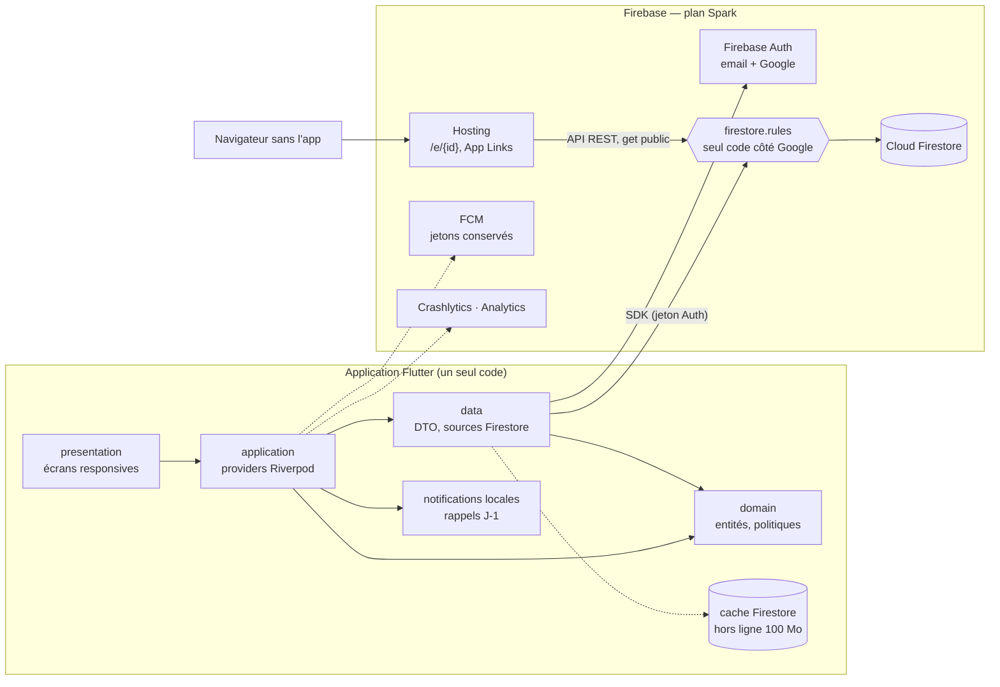
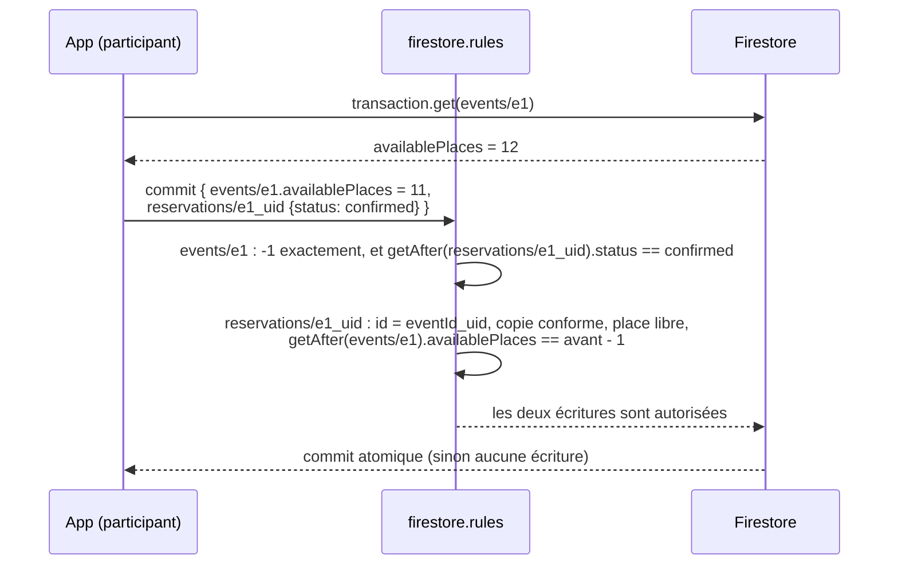

# EventHub — Architecture

> Référence technique. La vue produit est dans le [`README.md`](../README.md),
> le modèle de sécurité dans [`SECURITY.md`](SECURITY.md), les règles
> d'écriture du code de données dans [`CONVENTIONS.md`](CONVENTIONS.md).

EventHub est une application Flutter **multiplateforme** (Android, iOS, web,
Windows, macOS) organisée par fonctionnalité et en couches, adossée à
**Firebase Auth** et **Cloud Firestore** sur le plan gratuit **Spark**.

La contrainte qui façonne tout le reste : **il n'y a pas de code serveur**.
Cloud Functions, Cloud Storage et Cloud Scheduler exigent le plan Blaze
(compte de facturation), écarté volontairement. Ce qu'un backend ferait
habituellement — compteurs, cascades, notifications, rappels — est donc
réparti entre **le client**, qui écrit, et **les règles de sécurité**, qui
prouvent que l'écriture est légitime.

---

## 1. Vue d'ensemble



| Brique | Rôle | Plan |
|---|---|---|
| Firebase Auth | email + mot de passe (vérification d'adresse), Google, réinitialisation | Spark |
| Cloud Firestore | toutes les données ; cache hors ligne sur chaque plateforme | Spark (1 Gio, 50 k lectures / 20 k écritures / 20 k suppressions par jour) |
| Règles de sécurité | droits, formes, invariants inter-documents | Spark |
| Politique TTL | purge des notifications expirées (`expiresAt`) | à activer une fois |
| Hosting | page publique `/e/{id}`, `assetlinks.json`, accueil | Spark |
| FCM | jetons enregistrés (`users/{uid}/devices`) ; messages de premier plan | Spark ; **envoi serveur absent** |
| Crashlytics · Analytics | plantages, mesure d'audience sur consentement | gratuits |

---

## 2. Arborescence

```
lib/
├── main.dart · main_dev.dart · main_staging.dart · main_prod.dart   points d'entrée (flavors)
├── bootstrap.dart            Firebase.initializeApp, cache Firestore, émulateurs, Crashlytics, handler FCM
├── firebase_options.dart     généré par flutterfire, versionné (identifiants publics)
├── app/                      MaterialApp.router, thèmes « Aurora », bandeau hors ligne, consentement
├── routes/                   AppRoutes, RouteGuard (pur, testé), routeur, observateur Analytics
├── core/
│   ├── config/               Flavor, AppConfig (dart-defines), AppLinks, Clock
│   ├── firebase/             providers (FirebaseFirestore, FirebaseAuth, messaging),
│   │                         Collections / DocIds (firestore_paths.dart), convertisseur Timestamp
│   ├── errors/ · result/     Failure, ErrorMapper (FirebaseException, FirebaseAuthException), Result, guard
│   ├── analytics/ · connectivity/ · l10n/ · utils/ · extensions/
│   └── widgets/              design system, OfflineAware, écran d'erreur de démarrage
└── features/
    ├── auth/                 inscription, vérification d'email, Google, profil, suppression de compte
    ├── events/               catalogue paginé, recherche, fiche, formulaire, preuve sociale
    ├── reservations/         réserver / annuler en transaction, portefeuille, billet QR
    ├── favorites/ · waitlist/ · reviews/ · checkin/ · team/
    ├── organizer/            tableau de bord, stats, alertes, participants, export CSV
    ├── organizers/           page publique d'organisateur, abonnements
    ├── moderation/ · admin/  signalements · file de modération, décisions
    ├── notifications/        centre de notifications, préférences, rappels locaux, jetons FCM
    ├── participant/          espace participant, recommandations « Pour vous »
    └── onboarding/ · support/

firebase/
├── firestore.rules           le backend : droits, formes, preuves inter-documents
├── firestore.indexes.json    index composites + TTL de notifications.expiresAt
└── tests/                    node:test + @firebase/rules-unit-testing sur l'émulateur
hosting/public/               accueil, e.html (/e/{id}), pay/* (inactif), .well-known/assetlinks.json
env/                          dart-defines publics par flavor (dev.json et example.json versionnés)
firebase.json · .firebaserc   Firestore, Hosting, émulateurs (auth 9099, firestore 8080, hosting 5002, UI 4000)
```

---

## 3. Règle de dépendance

```
presentation ──▶ application ──▶ domain ◀── data
```

* **domain** — Dart pur : entités, politiques (`ReservationPolicy`,
  `EventPolicy`, `ReviewPolicy`…), calculs, interfaces de repositories. Aucun
  SDK : testable en millisecondes, sans émulateur.
* **data** — seule couche qui importe `cloud_firestore` / `firebase_auth`.
  DTO `freezed` en camelCase, miroir exact des champs attendus par les règles.
* **application** — providers et contrôleurs Riverpod. Un contrôleur exécute
  d'abord la politique du domaine (réponse instantanée, message précis), puis
  écrit ; les règles tranchent.
* Une feature n'importe jamais la couche `data` d'une autre : elle compose ses
  providers.

**Pourquoi cette double vérification ?** Les règles ne renvoient qu'un
`permission-denied` muet. Le domaine explique (« Cet événement est complet »),
les règles garantissent. Un client modifié peut sauter le domaine ; il ne peut
pas sauter les règles.

---

## 4. Modèle de données

Source de vérité : les blocs de commentaires de `firebase/firestore.rules`.
`?` = facultatif.

### 4.1 Comptes

| Chemin | Champs | Lecture | Écriture |
|---|---|---|---|
| `users/{uid}` | `name` 2–80 · `email` (= jeton) · `role` `participant`\|`organizer` · `bio?` ≤ 500 · `photoUrl?` ≤ 140 000 · `coverUrl?` ≤ 280 000 · `suspended?` · `welcomedAt?` · `createdAt` · `updatedAt?` | soi, administrateurs ; **jamais listé** | création `participant` par soi ; nom, bio et photos par soi ; passage `organizer` (sens unique) ; `suspended` par un admin |
| `users/{uid}/private/notifications` | `eventReminders` · `bookingAlerts` · `followedOrganizers` (bool) · `updatedAt?` | soi | soi |
| `users/{uid}/devices/{deviceId}` | `token` · `platform` · `updatedAt` | soi | soi |
| `users/{uid}/favorites/{eventId}` | `eventId` · `createdAt` | soi | soi |
| `users/{uid}/following/{organizerId}` | `organizerId` · `createdAt` | soi | soi, **avec** `organizers/{id}.followerCount ± 1` dans le même batch |
| `users/{uid}/notifications/{id}` | `type` · `title` · `body` · `eventId?` · `reservationId?` · `actorId` · `createdAt` · `readAt?` · `expiresAt` | destinataire | l'**acteur** du fait, sous conditions (§5.3) ; `readAt` par le destinataire |
| `admins/{uid}` | `email` · `name?` · `grantedAt` | soi (« suis-je admin ? »), admins | **console Firebase uniquement** |

### 4.2 Organisateurs

| Chemin | Champs | Notes |
|---|---|---|
| `organizers/{uid}` | `name` · `bio` · `photoUrl?` · `memberSince` · `followerCount` · `eventCount` · `ratingSum` · `ratingCount` · `lastEventId?` · `lastReviewId?` · `suspended?` | page publique (comptes connectés). Compteurs **prouvés** : chaque variation cite le document qui la justifie (`lastEventId`, `lastReviewId`, le document `following` de l'appelant). `photoUrl` est le miroir exact de celle du profil privé, exigé par la règle : c'est le seul moyen pour les autres comptes de voir le visage d'un organisateur |
| `organizerEmails/{sha256(email)}` | `uid` | un organisateur retrouve un compte à inviter par `get` d'**un** hash ; `list` interdit |

« Devenir organisateur » est **un batch** : `users/{uid}.role = organizer` +
`organizers/{uid}` (compteurs à zéro) + `organizerEmails/{hash}`. Email vérifié
exigé ; chaque document exige la présence des deux autres (`existsAfter`).

### 4.3 Événements

| Chemin | Champs |
|---|---|
| `events/{eventId}` | `title` 3–120 · `description` 1–5000 · `category` (liste fermée) · `startsAt` · `location` · `capacity` 1–100 000 · `availablePlaces` 0–capacity · `organizerId` (immuable) · `organizerName` · `imageUrl?` (https) · `staffIds` ≤ 10 · `tiers?` ≤ 6 `{id: {name, description, price, capacity, available, order}}` · `currency?` EUR\|USD\|MGA · `createdAt` · `updatedAt?` |
| `events/{id}/waitlist/{uid}` | `userId` · `createdAt` · `notifiedAt?` — FIFO par `createdAt` |
| `events/{id}/checkins/{reservationId}` | `reservationId` · `scannedBy` · `scannedAt` — ajout seul, par l'équipe |
| `events/{id}/invitations/{inviteeId}` | `eventId` · `userId` · `email` · `name` · `invitedBy` · `invitedByName` · `eventTitle` · `eventStartsAt` · `status` pending\|accepted\|declined · `createdAt` · `respondedAt?` |
| `events/{id}/attendees/{sha256(uid)}` | `name` ≤ 40 · `createdAt` — « Soa, Hery R. et 40 autres y vont » |

Les **types de billets** sont une map dans l'événement, pas une
sous-collection : réserver lit **un** document dans la transaction, et la
règle vérifie en une passe que le type choisi et le total ont bougé du même
±1.

### 4.4 Réservations, avis, modération

| Chemin | Champs |
|---|---|
| `reservations/{eventId}_{uid}` | `eventId` · `userId` · `organizerId` · `userName` · `userEmail` · `eventTitle` · `eventStartsAt` · `eventLocation` (copies de l'événement, vérifiées) · `status` confirmed\|cancelled · `reservedAt` · `cancelledAt?` · `cancelledBy?` · `tierId?` · `tierName?` · `pricePaid` (toujours 0) |
| `reviews/{eventId}_{uid}` | `eventId` · `organizerId` · `authorId` · `authorName` · `rating` 1–5 · `comment` ≤ 2000 · `hidden` · `createdAt` · `updatedAt?` |
| `reports/{type}_{target}_{uid}` | `targetType` event\|user\|review · `targetId` · `reason` (liste fermée) · `details` · `reporterId` · `createdAt` — écriture seule |
| `moderationQueue/{type}_{target}` | `targetType` · `targetId` · `reportCount` · `lastReason` · `status` open\|resolved\|dismissed · `decision?` · `decisionNote?` · `decidedBy?` · `decidedAt?` · `updatedAt` |
| `moderationQueue/{id}/decisions/{auto}` | `action` · `note` · `by` · `at` — journal, ajout seul |

**Dénormalisation assumée.** La réservation copie titre, date et lieu : le
portefeuille, la liste d'invités et le contrôle à l'entrée se lisent sans
jointure (Firestore n'en a pas), et un billet reste lisible après la
suppression de l'événement. La règle `matchesEvent()` empêche une copie
mensongère à la création.

---

## 5. Patterns « sans serveur »

### 5.1 Preuves dans les batchs (`getAfter` / `existsAfter`)

Un compteur n'est jamais écrit seul. Il part dans le **même commit** que le
document qui le justifie, et la règle lit l'état **tel qu'il sera après le
commit** :



Chaque moitié exige l'autre : un client qui n'envoie que la réservation (place
gratuite) ou que le décrément (vandalisme) est refusé. Deux personnes qui
réservent la dernière place au même instant : la transaction la plus lente
est rejouée, relit `availablePlaces = 0` et échoue proprement. **Aucune
survente**, sans verrou serveur.

Même mécanisme pour : abonnés (`following` ↔ `followerCount`), nombre
d'événements (`events` ↔ `eventCount` via `lastEventId`), note (`reviews` ↔
`ratingSum`/`ratingCount` via `lastReviewId`), type de billet (`tiers[id].available`
↔ `tierId` de la réservation), équipe (`staffIds` ↔ invitation acceptée),
signalement (`reports` ↔ `moderationQueue.reportCount`), passage organisateur.

### 5.2 Identifiants déterministes

L'identifiant **est** la contrainte d'unicité : `reservations/{eventId}_{uid}`,
`reviews/{eventId}_{uid}`, `reports/{type}_{target}_{uid}`. Détails et table
complète : `CONVENTIONS.md` §3.1.

### 5.3 Notifications écrites par l'acteur

Sans Cloud Function, c'est la personne **qui cause** le fait qui écrit la
notification dans `users/{destinataire}/notifications`. Pour que ce ne soit
pas une porte ouverte au spam, la règle exige :

1. un `type` connu, `actorId == request.auth.uid`, `createdAt` serveur, non lue ;
2. un **identifiant déterministe** construit à partir du fait (ex.
   `booking_{eventId}_{uid}_{reservedAtMillis}`) : une seule notification par
   fait, rejouer n'inonde pas ;
3. la **preuve du fait** : la réservation de l'appelant est confirmée, le
   destinataire est bien dans l'équipe, la place est bien libre pour la liste
   d'attente, l'invitation existe, l'appelant est admin pour une décision de
   modération…

Écriture **best-effort** après le commit métier (`CONVENTIONS.md` §3.3). Les
notifications expirent via la **politique TTL** sur `expiresAt` (30 jours).

### 5.4 Rappels J-1 sur l'appareil

Le rappel de la veille est une **notification locale** planifiée par
`flutter_local_notifications` au moment de la réservation (et replanifiée au
démarrage à partir du portefeuille, annulée à l'annulation). Contreparties :
pas de rappel sur un appareil où l'app n'a jamais été ouverte depuis la
réservation ; pas de rappel sur le web (pas de planification fiable dans un
onglet fermé). Préférence : `eventReminders`.

### 5.5 Push

Les jetons FCM sont enregistrés dans `users/{uid}/devices` et les messages
reçus au premier plan sont affichés, mais **aucun serveur n'envoie de push**
quand l'app est fermée : envoyer un message FCM exige un compte de service,
donc un backend. Le centre de notifications (Firestore, temps réel) couvre
l'app ouverte. Les jetons sont conservés pour un futur émetteur Blaze
(`ROADMAP.md` §6).

### 5.6 Suppression de compte côté client

Séquence (chaque étape autorisée par une branche dédiée des règles) :

1. ré-authentification (mot de passe ou Google) — Auth exige une connexion
   récente pour supprimer ;
2. l'app refuse s'il reste un événement à venir **avec** participants
   (supprimer l'événement serait refusé par les règles de toute façon) ;
3. places à venir **libérées** : transaction réservation `cancelled` +
   `availablePlaces + 1` ;
4. historique **anonymisé** : `reservations.userId = ''`, `userName = 'Compte
   supprimé'`, `userEmail = 'supprime@eventhub.invalid'` ; idem `reviews.authorId` ;
5. abonnements supprimés (avec `followerCount - 1`), favoris, appareils,
   préférences, notifications, entrée `organizerEmails`, page `organizers`,
   puis `users/{uid}` ;
6. `FirebaseAuth.currentUser.delete()` en **dernier**.

Si l'app est interrompue au milieu, la personne est encore connectée et peut
relancer : chaque étape est idempotente. Contrepartie : sans serveur, un
compte Auth supprimé ne peut pas « nettoyer derrière lui » ce qui a échoué
avant.

### 5.7 Images

Pas de Cloud Storage : l'organisateur saisit une **URL https** (validée par
`isHttpsUrl` dans les règles, 2048 caractères max). Contrepartie : l'image
peut disparaître ou changer chez son hébergeur ; aucun contrôle de contenu.

### 5.8 Pagination et limites

* Catalogue : première page en temps réel (`limit ≤ 200` imposé par les
  règles), pages suivantes par curseur `startAfterDocument` sur `startsAt`.
* Toute requête `list` est bornée et épingle le filtre qui prouve le droit
  (`CONVENTIONS.md` §3.4).
* Budget des règles : 10 lectures de documents par requête, 20 dans un batch
  ou une transaction — les helpers qui lisent sont marqués `// read`.
* Quotas Spark : 50 000 lectures/jour. Le cache hors ligne et les écouteurs
  temps réel (une lecture par document **modifié**, pas par rafraîchissement)
  sont les premières économies.

### 5.9 Paiements

Désactivés. `reservations.pricePaid` doit valoir 0 et seul un type de billet
**gratuit** est réservable (`tierBookable()`). Encaisser exige un secret Stripe
et un webhook signé : impossible sans serveur (`ROADMAP.md` F-11).

---

## 6. Authentification

* **Session** : `authStateChanges()` → document `users/{uid}` écouté en temps
  réel ; un délai de grâce (`profileGracePeriod`, 3 s) couvre l'écart entre
  création du compte et création du profil.
* **Inscription** : compte Auth, puis `users/{uid}` avec `role: participant`
  (la règle refuse tout autre rôle), puis `sendEmailVerification()`. Les
  e-mails (vérification, réinitialisation) sont envoyés **par Firebase Auth**,
  avec ses modèles personnalisables dans la console — aucun SMTP à gérer.
* **Vérification d'email** : exigée pour publier, laisser un avis et devenir
  organisateur (`request.auth.token.email_verified`). Après avoir cliqué le
  lien, l'app force `user.reload()` puis `getIdToken(true)` pour que le jeton
  porte la nouvelle valeur.
* **Google** : web par popup Firebase ; iOS par `GIDClientID` (Info.plist) ;
  Android par `google_sign_in` avec `GOOGLE_SERVER_CLIENT_ID` (sinon bouton
  masqué) ; pas de fournisseur Google sur desktop dans FlutterFire.
* **Administrateur** : `admins/{uid}` lu par un `get` sur son propre uid,
  autorisé même si le document n'existe pas.
* **Suspension** : `users/{uid}.suspended`, relu par les règles à chaque
  écriture qui passe par `isActive()` — effet immédiat, sans attendre
  l'expiration du jeton.

---

## 7. Navigation et liens profonds

Deux `StatefulShellRoute` (espace participant, espace organisateur) ;
`RouteGuard.redirect` est une fonction pure testée. `/admin/**` n'est ouvert
qu'aux administrateurs.

`https://eventhub-d411f.web.app/e/{id}` est un lien unique :

* **Android avec l'app** — intent filter auto-vérifié
  (`hosting/public/.well-known/assetlinks.json`) → route `/e/:eventId`.
* **Sans l'app** — Hosting réécrit `/e/**` vers `e.html`, qui lit
  l'événement par l'**API REST Firestore** (`GET …/documents/events/{id}?key=…`
  avec un masque de champs), décode les valeurs typées et rend la page avec
  `textContent` uniquement. Les robots d'aperçu (WhatsApp, Slack) n'exécutent
  pas JavaScript : ils voient un titre générique (un rendu serveur Open Graph
  demanderait une Cloud Function).

Un lien ouvre souvent l'app à froid : `RouteGuard` le conserve dans `?from=`
à travers `/splash` et `/login` (liste blanche `AppRoutes.isDeepLinkTarget`).

---

## 8. Hors ligne

`bootstrap.dart` active la persistance Firestore sur **toutes** les plateformes
(le web la désactive par défaut) avec 100 Mo de cache : un billet déjà affiché
s'ouvre à la porte sans réseau. Les écritures hors ligne sont mises en file
par le SDK, **sauf les transactions**, qui exigent le serveur (réserver,
annuler) : l'UI les désactive hors ligne (`OfflineAware`).

---

## 9. Configuration et flavors

`FLAVOR` + `env/<flavor>.json` passés par `--dart-define-from-file` :

| Clé | Effet |
|---|---|
| `USE_FIREBASE_EMULATOR` | `true` → Auth 9099 et Firestore 8080 locaux |
| `FIREBASE_EMULATOR_HOST` | `localhost` ; `10.0.2.2` depuis l'émulateur Android ; IP du poste depuis un téléphone |
| `GOOGLE_SERVER_CLIENT_ID` | client OAuth *web* ; requis pour Google Sign-In sur Android |
| `FIREBASE_WEB_VAPID_KEY` | clé Web Push publique ; sans elle, pas de jeton FCM web |

---

## 10. Stratégie de test

| Couche | Comment |
|---|---|
| domain | tests unitaires purs (politiques, calculs, recommandations, phrase de preuve sociale) |
| data | parsing des DTO, construction des identifiants, payloads conformes aux règles |
| core | Result/guard, ErrorMapper, AppLogger |
| routes | RouteGuard comme fonction pure |
| presentation | widgets et goldens avec providers surchargés, à plusieurs largeurs d'écran |
| **règles** | `make rules-test` : `@firebase/rules-unit-testing` contre l'émulateur Firestore — chaque règle est éprouvée **en tant qu'attaquant** (batch incomplet, compteur gonflé, identifiant forgé, rôle usurpé) ; job CI `firestore-rules` |
